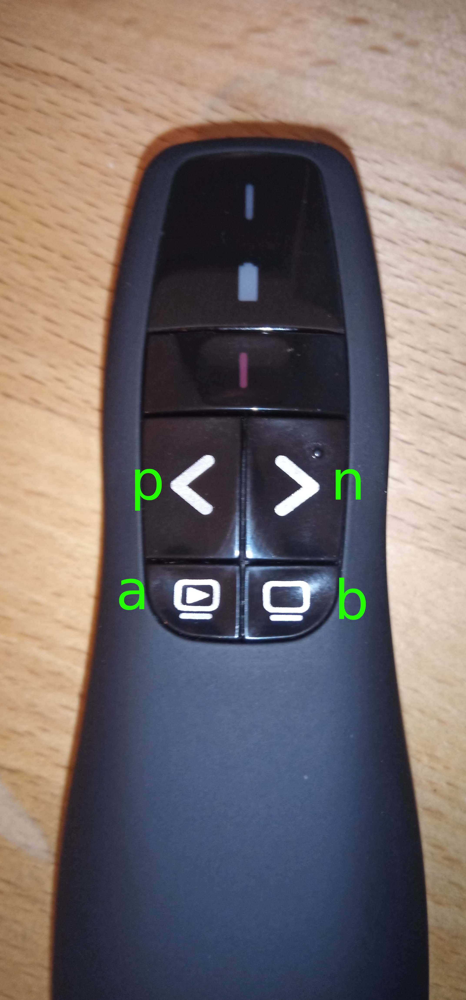

# LogiPresenterRemap
Tool for remapping Logitech Wireless Presenter R400 Buttons to regular Keys. Based on [Intercetion](http://www.oblita.com/interception.html).

## Installation / Usage
1. Install the interception driver: [Instructions](http://www.oblita.com/interception.html)
2. Download Unpack the [release](https://github.com/auenkind/logipresenterremap/releases/download/1.0.0/logipresenterremap_1.0.0.zip) to any folder
3. Run the unpacked LogiRemoteRemap.exe

The Presenters keys will be mapped to "normal" keyboard keys a b p n as long as the application is running.

